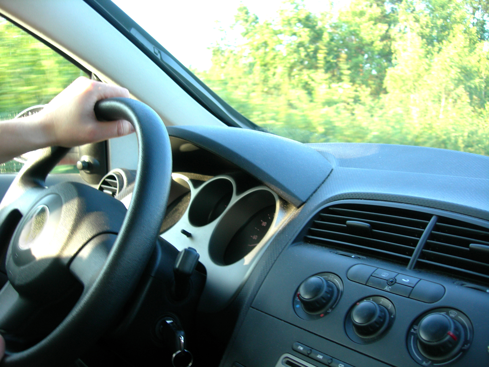
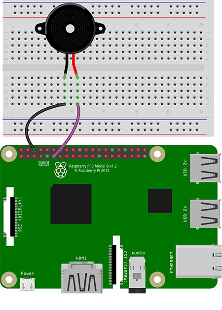
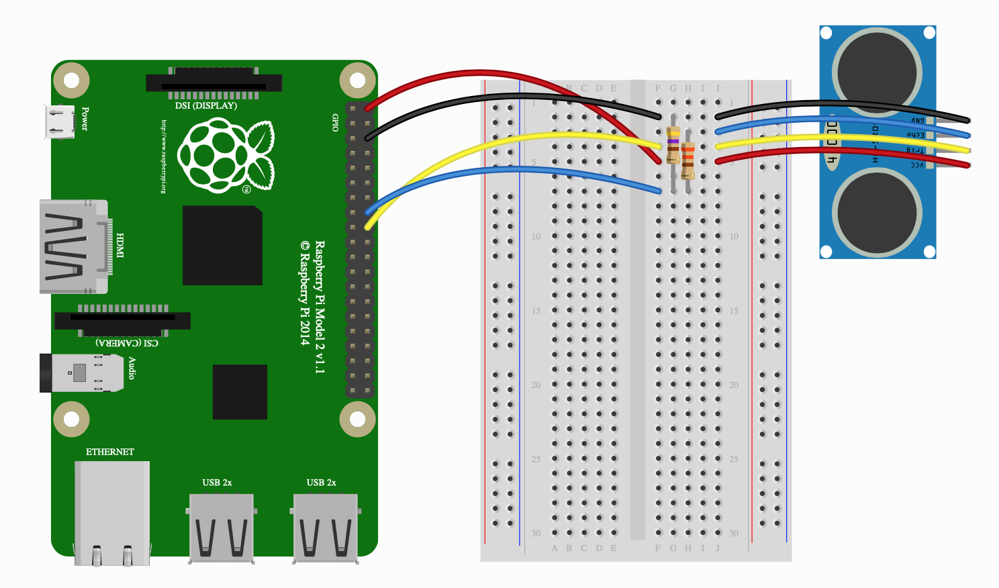

# Car obstacle avoidance

<picture>
  
</picture>

### Introduction : 
In the realm of vehicle safety, collision warning systems have become a standard feature in all types of vehicles, helping to prevent accidents during parking and similar situations. Our system takes inspiration from this concept, aiming to alert drivers about nearby obstacles by employing a similar mechanism. As we delve into the details, we'll explore how our system functions and its practical implications.

### How It Operates : 
Our system utilizes ultrasonic sensors and a buzzer. Ultrasonic sensors detect nearby objects using sound waves. When an object gets close, the sensors measure the time it takes for the sound to bounce back, helping determine the distance. If the distance is below a certain threshold, the buzzer activates, warning the driver. This alerts the driver to the presence of nearby obstacles, aiding in avoidance.

Tools:
* Raspberry Pi
* Buzzer
* Ultrasonic sensor

  

<picture>
  
</picture>

<picture>
  
</picture>

### The code:
[click here](test2.py)

### The Team:
* [Tala Shweiki](https://github.com/talashweiki)
* [Zaina Musleh](https://github.com/Zainamusleh)
* [Hala Kharouf](https://github.com/hala214)

